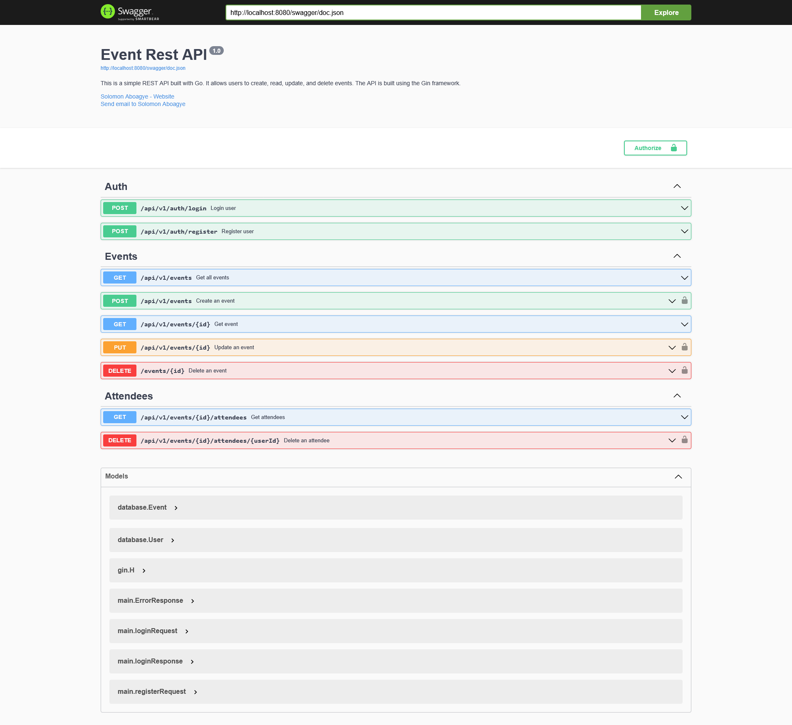

# My First REST API in Go

## Introduction

This is a simple REST API built with Go. It is a simple CRUD API that allows users to create, read, update, and delete events. The API is built using the [Gin](https://github.com/gin-gonic/gin) framework and the [Gorm](https://github.com/go-gorm/gorm) ORM.

## Prerequisites

- Go 1.16+
- Docker

## Getting Started

### 1. Clone the repository

```bash
git clone https://github.com/aboagye-dacosta/event-api-in-golang.git
```


